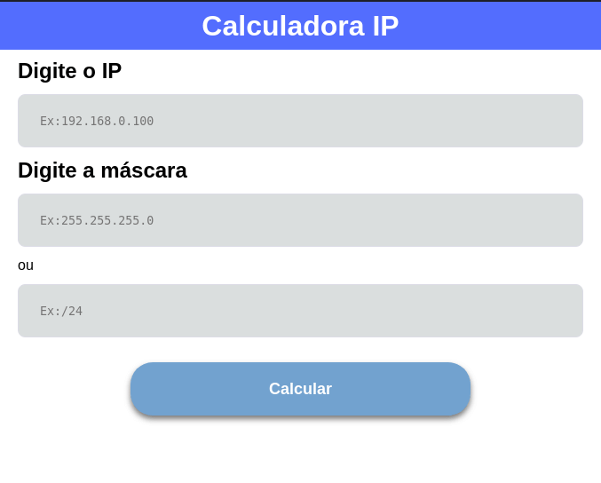
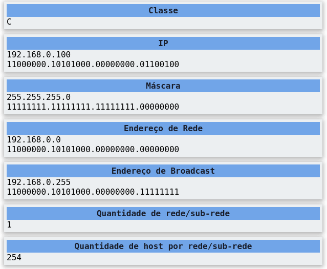
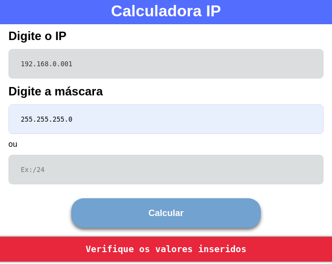

 

# :tada: Calculadora IP :tada:

A calculadora verifica informações sobre **sub-rede**, **máscara**, **broadcast**, **quantidade de sub-rede** e **quantidade de host**.

## Capturas de telas :camera:

### Tela inicial

### Resultado

### Notificação de erro

## License :memo:

Este projeto está licenciado sob a licença MIT - Veja o arquivo [LICENSE](LICENSE) para detalhes.
